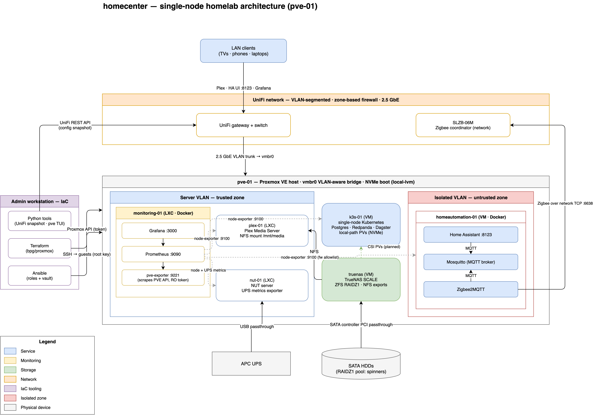

# homecenter — a homelab run like production

Infrastructure-as-code for my single-node homelab that I designed, built, and operate
end-to-end: virtualization, storage, network segmentation, monitoring, and automation — 
Manages LXC containers and VMs on Proxmox using  Terraform and Ansible. Documented as
runbooks

The lab exists for two reasons: to run real services for my home, and to be a permanent
playground for infrastructure and data-platform skills.

<p align="center">
  <a href="docs/architecture/homelab-architecture.drawio.png">
    
  </a>
</p>

---

## Project Structure

```
homecenter/
│
├── docs/
│   ├── architecture/         # naming conventions, overview
│   ├── infrastructure/       # hardware inventory, node specs
│   ├── network/              # network diagram
│   ├── runbooks/             # per-service recovery guides
│   └── future_planning/      # hardware repurposing, lab ideas
│
├── ansible/
│   ├── inventory/
│   │   └── hosts.yml
│   ├── playbooks/            # one playbook per service
│   └── roles/                # homeassistant, plex, monitoring, nut
│
├── terraform/
│   └── pve-01/               # LXC/VM definitions for pve-01
│   
├── network/
│   └── unifi/
│       ├── configs/              # JSON exports (device, networks, firewall, wlan, ports)
│       ├── fetch_config.py       # snapshots UniFi config via API # TODO: move to tools
│       └── README.md             # setup and usage
|
└── tools/                  
    └── pve/
        └── status.py
```

---

## The stack at a glance

| Layer | Technology | What I do with it |
|---|---|---|
| Hypervisor | Proxmox VE on a 14-core / 20-thread Intel host | LXC containers + KVM virtual machines, PCI controller passthrough, CPU pinning |
| Provisioning | Terraform (`bpg/proxmox` provider) | Declarative container/VM definitions, cloud-init templates, API-token auth |
| Configuration | Ansible | One role per service, ansible-vault for secrets, idempotent re-runnable playbooks |
| Storage | TrueNAS SCALE VM, ZFS RAIDZ1 | Full SATA-controller passthrough for native disk access, NFS exports to services |
| Network | UniFi (2.5 GbE), VLAN-segmented | Zone-based firewall, isolated zones for untrusted workloads, trunked VLAN-aware bridge |
| Observability | Prometheus + Grafana + exporters | node-exporter fleet, Proxmox API exporter, custom textfile exporter, custom dashboards |
| Tooling | Python | UniFi config-snapshot tool with secret masking, terminal resource-overview TUI |

---

## Design decisions

**Everything is code, and the exceptions are documented.** Terraform provisions the
guests; Ansible configures the services inside them. Where the Proxmox API has genuine
gaps (raw LXC config entries, feature flags restricted to root), the manual steps are
written down as comments next to the exact resource they affect — so a rebuild is a
checklist, not archaeology.

**Blast radius drives placement.** Most services run as containers on the trusted
server VLAN. The home-automation stack — which runs third-party integrations and has a
web-facing UI — got a full VM on its own *isolated* VLAN instead, with an explicit
allowlist firewall policy (UI port in, Zigbee coordinator out, SSH for Ansible,
one port for Prometheus scraping). Same hypervisor, deliberately different trust level.

**Root is the deployment user — deliberately.** Ansible connects as root with a
dedicated SSH key. The LXC appliance containers have no other users by design, so
sudo would add a layer without adding a boundary. The real privilege boundaries live
at the hypervisor and VLAN level, which is where the hardening effort goes.


**Storage gets native hardware.** ZFS wants to talk to real disks. The NAS VM receives
the entire SATA controller via PCI passthrough rather than virtualized disks — SMART,
cache flushing, and error reporting all work as if bare-metal, while the hypervisor
keeps its own NVMe boot pool untouched.

**Monitoring watches the platform, not just the apps.** Prometheus scrapes a
node-exporter on every guest (targets generated dynamically from the Ansible
inventory — adding a host to the inventory is the whole onboarding process), a
Proxmox-API exporter for hypervisor and per-guest metrics using a scoped read-only
token, and a small custom textfile exporter I wrote for UPS battery/load/runtime
metrics. Custom Grafana dashboards join guest names onto metrics with PromQL.

**Network config is version-controlled, even when the vendor doesn't help.** A Python
tool snapshots the UniFi controller configuration (networks, firewall zones and
policies, port profiles, WLANs) through its REST API into diffable JSON — with
recursive masking of secret fields — so network changes show up in `git diff` like
any other infrastructure change.

**Secrets are boring on purpose.** API tokens and passwords live in ansible-vault;
Terraform state and variable files are excluded from version control; the monitoring
exporter authenticates with a revocable read-only token rather than a user password.

---

## What it actually runs

- **Media**: Plex in a container, serving libraries from a ZFS dataset over NFS
- **Home automation**: Home Assistant stack in an isolated VM (MQTT + Zigbee-over-network planned as the mesh grows)
- **Power resilience**: NUT server monitoring a USB-attached UPS, exposing status
  network-wide and feeding Prometheus
- **Observability**: the Prometheus/Grafana stack described above, monitoring
  everything including itself
- **Kubernetes**: a single-node k3s cluster in a dedicated VM — a landing zone for
  stable home services and data-platform learning projects (Postgres, Redpanda,
  Dagster), with PVs on their own disk via the local-path provisioner

## Operations

Every service has a runbook: what was deployed, the key decisions and *why* (as a
decision table), pre-flight checklists, verification commands, and known follow-ups.
When something broke — containers silently losing VLAN assignments after reboot, a
25-second SSH login delay traced through PAM into cgroup namespaces — the outcome was
a root-cause writeup and, where possible, an automated fix (e.g. a systemd oneshot
service, deployed by Ansible, that re-derives VLAN assignments from container configs
at boot; no hardcoded IDs).

The repo also tracks its own debt honestly: what's manual and why, what's not yet
automated, and the ordered plan to close each gap. I find that discipline — knowing
exactly where your infrastructure deviates from its description — is the actual skill;
the tools are interchangeable.

---

## Where it's heading

In-cluster workloads for the k3s node — Postgres, Redpanda (memory-capped), and
Dagster, tracked as code in this repo; a TrueNAS-backed storage class via
democratic-csi; Proxmox Backup Server on repurposed hardware; VPN-gated
remote access; and gradually pushing the remaining hand-managed pieces (NAS
configuration via its REST API, host network config) into code.

---

## Docs

- [Architecture diagram](docs/architecture/homelab-architecture.drawio.png) — editable in draw.io (embedded XML)
- [Naming conventions](docs/architecture/naming.md)
- [Pinned image versions](docs/architecture/image-versions.md)
- [IP addressing](docs/network/ip-addressing.md) - redacted
- [Hardware inventory](docs/infrastructure/hardware_inventory.md) - redacted
- [Network diagram](docs/network/diagram.md) - redacted
- Runbooks: [Home Automation](docs/runbooks/homeautomation-vm.md) · [Plex](docs/runbooks/plex-lxc.md) · [Monitoring](docs/runbooks/monitoring-lxc.md) · [NUT](docs/runbooks/nut-server-lxc.md) · [TrueNAS](docs/runbooks/truenas-init-notes.md) · [NVMe health](docs/runbooks/pve-01-nvme-health.md) · [k3s](docs/runbooks/k3s-vm.md) · [Image version pinning](docs/runbooks/image-version-pinning.md)